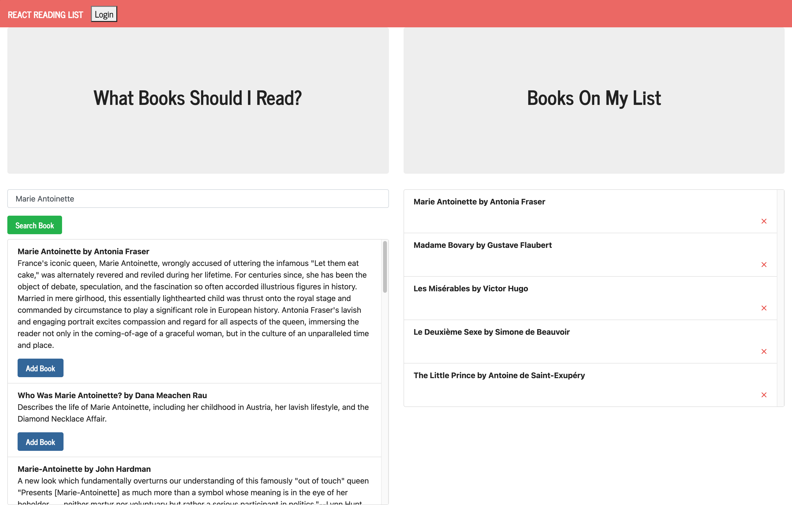

# Google Books Search

This application allows the user to quickly search books available in the Google Books API and add them to a "wish list" of books to read later. 

## Technologies

The application was built with REACT and several NODE packages.

## Pages

https://books-search-io.herokuapp.com/

## Contributing

Pull requests are welcome. 

### MIT License

